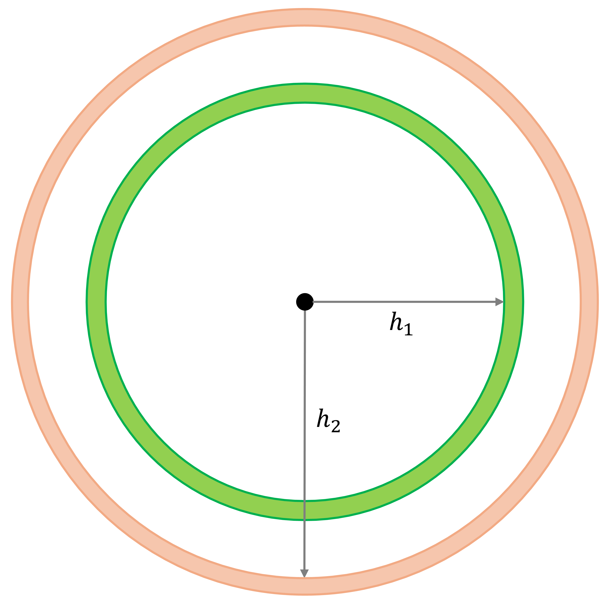
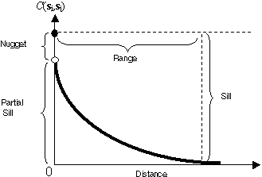
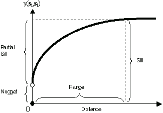

## Spatial dependence in spatially continuous data

- Spatial interpolation assumes that the data exhibit positive spatial autocorrelation.
- Single-scale autocorrelation measures, such as the global Moran's I statistic, are not well-suited for spatially continuous data due to its smooth nature, where neighborhoods are not well-defined.
- Consequently, a measure that quantifies autocorrelation at different scales is required.

## Variographic analysis

:::{style="text-align:center;"}
{width=330}
:::

We define a binary spatial weight matrix as:

$$
w_{ij}(h)=\bigg\{\begin{array}{l l}
1\text{, if } d_{ij} = h\\
0\text{, otherwise}\\
\end{array}
$$

## Variographic analysis

**Autocovariance**:

$$
C_{z}(h) = \frac{\sum_{i=1}^{n}{w_{ij}(h)(z_i^2 - \bar{z})(z_j^2 - \bar{z})}}{\sum_{i=1}^n{w_{ij}(h)}}
$$

**Semivariance**:

$$
\hat{\gamma}_{z}(h) = \frac{\sum_{i=1}^{n}{w_{ij}(h)(z_i - z_j)^2}}{2\sum_{i=1}^n{w_{ij}(h)}}
$$

## Covariogram and semivariogram

::::: {style="font-size: 0.8em;"}

:::: {.columns}

::: {.column width="50%"}
Covariogram:

 
:::

::: {.column width="50%"}
Semivariogram:

:::

::::

The autocovariance, $C_{z}(h)$, and semivariance, $\hat{\gamma}_{z}(h)$, are related as follows: 
$$ C_{z}(h) = \sigma^2 - \hat{\gamma}_{z}(h) $$
where $\sigma^2$ is the sample variance.

:::::

## Kriging

::: {style="font-size: 0.72em;"}

All kriging variants produce predictions of the form:

$$
\hat{Z}(s_0)=\sum_{i=1}^n \lambda_i Z(s_i)
$$

where

- $\hat{Z}(s_0)$ is the predicted value at location $s_0$,
- $Z(s_i)$ is the observed value at location $s_i$,
- $\lambda$ are weights chosen to satisfy unbiasedness and minimize prediction variance.

The key difference from IDW or k‑nearest‑neighbor averaging is that kriging weights are determined by the spatial covariance (or semivariogram) structure, not just distance. The covariance model encodes how similarity decays with spatial separation, and kriging uses this to compute the best linear unbiased predictor (BLUP).

:::

## Universal Kriging

::: {style="font-size: 0.72em;"}

A spatial process with a non‑constant mean can be written as: $Z(s_i) = f(s_i) + \epsilon(s_i)$

where

- $f(s_i)$ is the deterministic trend (e.g., a polynomial surface or covariate‑based regression),
- $\epsilon(s_i)$ is a zero‑mean Gaussian random field with covariance: $\epsilon \sim N(0,\Sigma)$, $\Sigma_{ij}=C(s_i-s_j)$, and $C(\cdot)$ is a valid covariance function derived from the fitted variogram.

Prediction at a new location $s_p$ decomposes into trend + kriged residual:

$\hat{Z}(s_p) = \underbrace{\hat{f}(s_p)}_{\text{a smooth estimator, e.g., trend surface}} + \hat{\epsilon}(s_p)$

The residual prediction is a weighted combination of observed residuals: $\hat{\epsilon}(s_p) = \sum_{i=1}^n {\lambda_{i}\epsilon_i}$ and $\epsilon_i = Z(s_i) - \hat{f}(s_i)$.

:::

## Universal Kriging

::: {style="font-size: 0.72em;"}

To obtain the weights $\lambda$, kriging solves:

- Unbiasedness constraint: $E[\hat{Z}(s_p)-Z(s_p)]=0$, which ensures the predictor is unbiased for any trend coefficients $\beta$.
- Minimum prediction variance: $\lambda=\text{arg}\underset{\lambda}{\text{min}}\ Var(\hat{\epsilon}(s_p)-\epsilon(s_p))$.

Because unbiasedness constraint, the bias term vanishes, and the expected mean squared error reduces to the prediction variance:
$$
MSE(s_p) = E[(\hat{Z}(s_p)-Z(s_p))^2] = Var(\hat{\epsilon}(s_p)-\epsilon(s_p))
$$

Once the optimal weights $\lambda$ are obtained for location $s_p$, the Gaussian assumption on the residual field provides a closed-form expression for the kriging prediction variance, which can be used to construct interval estimates.

:::

## Activities for today

- We will work on the following chapter from the textbook:
  - Chapter [36](https://paezha.github.io/spatial-analysis-r/activity-17-spatially-continuous-data-iii.html): Activity 17: Spatially Continuous Data III
  - Chapter [38](https://paezha.github.io/spatial-analysis-r/activity-18-spatially-continuous-data-iv.html): Activity 18: Spatially Continuous Data IV
- The hard deadline is **Tuesday**, **March 24**.

## Reference

- <https://pro.arcgis.com/en/pro-app/latest/help/analysis/geostatistical-analyst/understanding-a-semivariogram-the-range-sill-and-nugget.htm>
