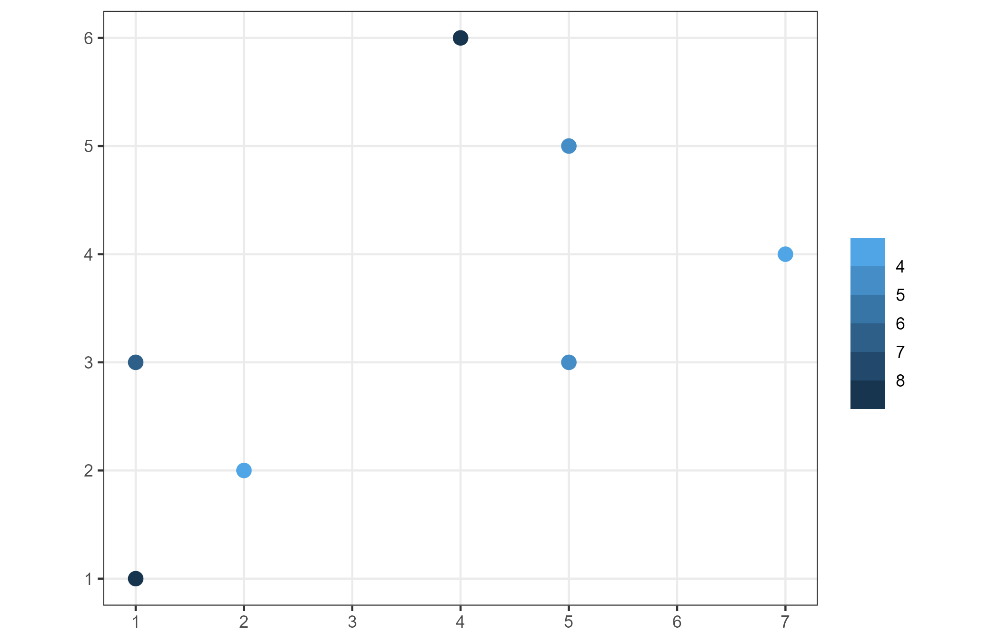
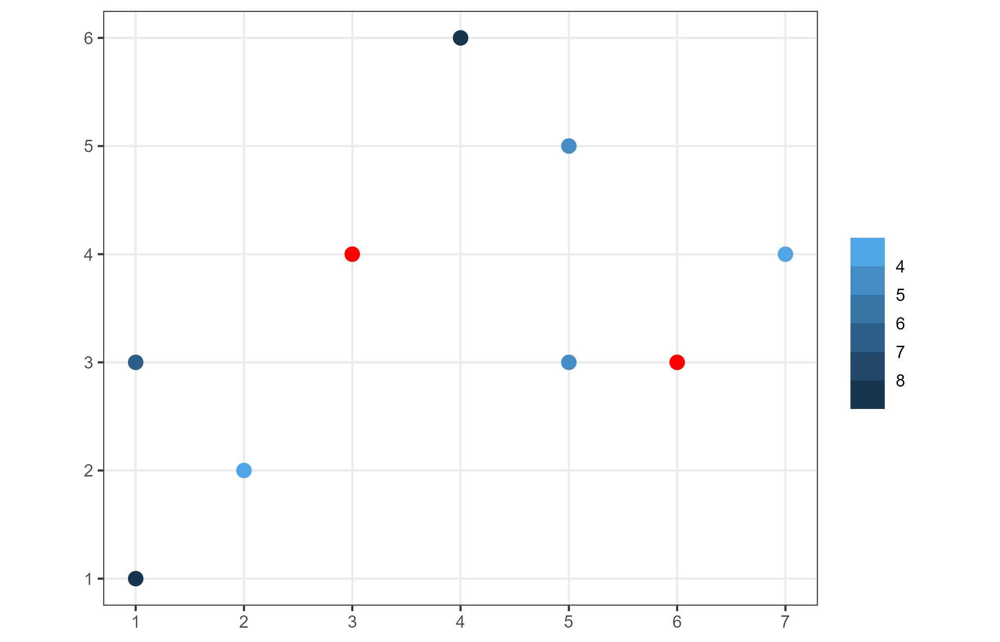
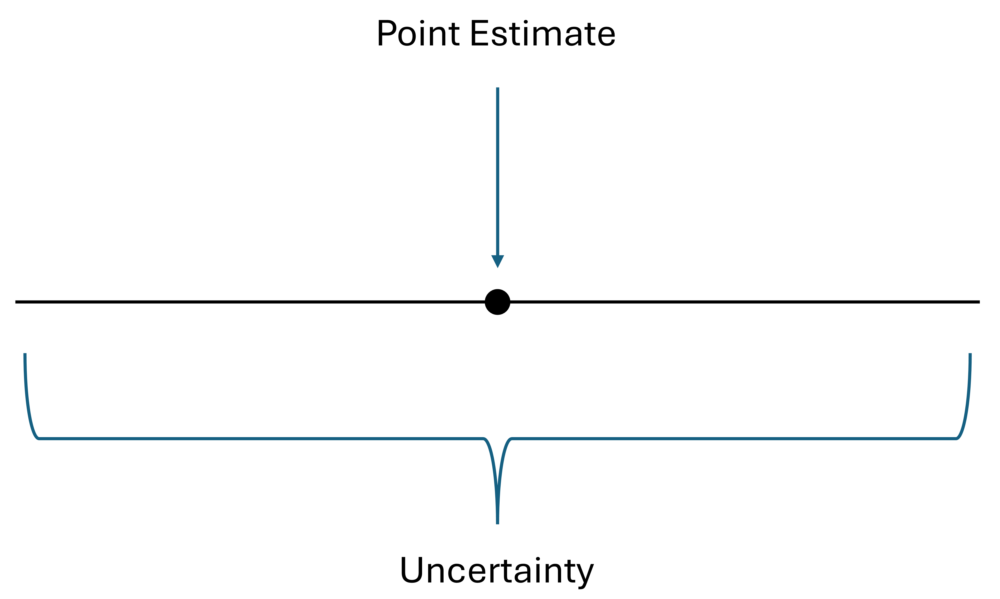
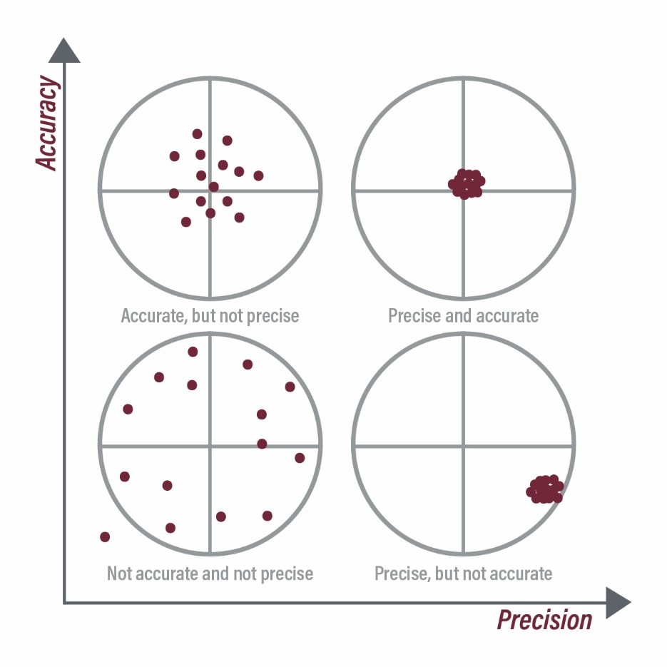

## Spatially continuous data

- Previously, we explored point data and area data, which are associated with discrete events, such as store locations or individual residents.
- In contrast, spatial phenomena can be continuous rather than discrete.
- Examples of continuous phenomena include elevation and temperature.
- Continuous data are typically stored in raster formats but can also be represented as vector points.

## Spatially continuous data

:::{style="text-align:center;"}

{width=500px}
:::

:::{style="font-size: 0.8em;"}
- Here, each point represents a measurement of the underlying continuous process, rather than a discrete event.
- The methods we’ll discuss this week are specific to continuous data and are not suitable for point pattern analysis, and vice versa.
:::

## Motivation for spatial interpolation

:::: {.columns}

::: {.column width="60%"}

:::

::: {.column width="40%"}
:::{style="font-size: 0.7em;"}
- Since it is impossible to observe an entire continuous process, there are infinitely many points that remain unobserved.
- To understand the process at a specific, unknown location, we aim to estimate its value based on available data.
- Spatial interpolation techniques address this challenge by providing methods to predict values at these unmeasured points.
:::
:::

::::

## Spatial interpolation

:::{style="font-size: 0.8em;"}

**Voronoi Polygons/Tessellation**:

- Predict the value of an unknown point by assigning it the value of the nearest known point.

**Inverse distance weighting (IDW)**: $\hat{z_p}=\frac{\sum_i\frac{z_i}{d_{pi}^\gamma}}{\sum_i\frac{1}{d_{pi}^\gamma}}$

- Here, $d_{pi}$ represents the (Euclidean) distance between the unknown point $p$ and a known point $i$.

**$k$-Point Means/$k$-Nearest Neighbours**:

- Predict the value of an unknown point using the average value of the $k$-nearest known points.

:::

## Point estimate and uncertainty

:::{style="text-align:center;"}
{width=500px}
:::

:::{style="font-size: 0.9em;"}
The theoretical spatial continuous process: $z_i = f(u_i, v_i) + \epsilon_i$

Where $\hat{f}(u_i, v_i)$ represents the point estimate for location $i$.

Uncertainty is the interval that is likely to capture the true value, $z_i$.
:::

## Accuracy and precision

:::{style="text-align:center;"}
{width=550px}
:::

## Activities for today

- We will work on the following chapter from the textbook:
  - Chapter [32](https://paezha.github.io/spatial-analysis-r/activity-15-spatially-continuous-data-i.html): Activity 15: Spatially Continuous Data I
  - Chapter [34](https://paezha.github.io/spatial-analysis-r/activity-16-spatially-continuous-data-ii.html): Activity 16: Spatially Continuous Data II
- The hard deadline is **Tuesday**, **March 17**.

## Reference

- <https://blogs.extension.msstate.edu/theriskproject/accuracy-and-precision/>
